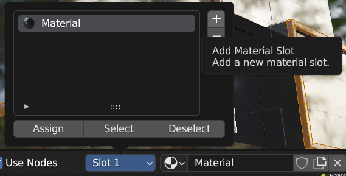

<style>
img{ padding: 10px 10px 10px 10px; border-radius: 10px; box-shadow: rgba(0, 0, 0, 0.24) 0px 3px 8px; }
body{ background-color: #1F1F1F;
    color: white
    }
a{
   color: cyan;
}
.hljs {
	background-color: #333333;
   color: #FFFFFF;
	
}
</style>

[<button > RETOUR AU MENU PRINCIPAL </button>](Index.md)

# Matériaux et Textures
## Pratique


1. [Matériau de Vitres](#Vitres)
2. [Utiliser Plusieurs Matériaux](#MultipleMat)
3. [Métal](#Metal)
4. [Matériau Luminescent](#Emitter)

___
___

### Pour commencer, si vous n'avez pas suivi le cours sur la [Modélisation](Mod%C3%A9lisation%20Extrusion%20-%20Biseau%20-%20D%C3%A9coupe.md), il faut télécharger le  **[Fichier Blender](Sources/Fichiers%20Blender/Shader%20Pratique%20Building.blend)** et l'ouvrir.

### Aussi, l'activation de l'Add-on **Node Wrangler est nécessaire**. Pour se faire:
- Aller dans Edit>Preferences
- Aller dans Add-ons dans les onglets disponibles
- Chercher Node Wrangler et cocher l'add-on


### Pour comprendre comment utiliser les matériaux, nous allons créer 3 matériaux:
- Un matériau pour les vitres (vues de l'extérieur)
- Un matériau de métal pour les structures externes
- Un matériau luminescent pour la lumière de nuit


```
On se rend dans l'onglet de Shading
```

*L'onget de Shading se situe tout en haut de l'écran à coté des menus déroulants.  
Se référer au [cours](Cours-Shader-Editor) pour en apprendre plus.* 


___
<br>
<div id="Vitres"> </div>


<center>

# Vitres

</center>

```
Créer un nouveau matériau
```
*Cliquer sur le bouton "+ New" qui se trouve au milieu de l'écran.*


```
Choisir la couleur du matériau, dans notre cas: 0F151B
```
*Cliquer sur le rectangle blanc à droite du **Base Color** du noeud **Principled BSDF**. Choisir d'entrer la couleur en Hex (Hexadécimal) et entrer la valeur suivante: 0F151B*


```
Mettre la roughness à 0 et le clearcoat à 1
```

*L'objectif est de n'avoir aucun flou dans les réflexions et d'accentuer leur force avec une couche de brillance qui simulera les propriétés des vitres de building.*
##### *[En Apprendre plus sur ces propriétés](https://befr.saint-gobain-building-glass.com/sites/saint-gobain-building-glass.com/files/documentPdf/Verre%20pour%20Fa%C3%A7ades%20FR%20LR.pdf)*


```
Ajouter un noeud Bump et le faire sortir vers la Normal du Shader
```
*Faire **Add>Vector>Bump** et lier le **"Normal"** à droite du nouveau noeud **Bump** à l'entrée **Normal** du noeud **Principled BSDF***


```
Ajouter un noeud Checker Texture et le lier au Height du Bump
```
*Faire **Add>Texture>Checker Texture** et lier le **"Fac"** à droite du nouveau noeud **Checker Texture** à l'entrée **Height** du noeud **Bump***


```
Sélectionner le Checker Texture et faire CTRL+T
```
*Cette étape ne fonctionne que si l'add-on Node Wrangler est [activé](#NodeWrangler)*.  
*Elle affiche alors 2 noeuds: Texture Coordinate et Mapping.*


```
Lier le Texture Coordinate en Generated au noeud de Mapping si ça n'est pas déjà le cas. Et mettre 2 dans la Scale sur l'axe Z du noeud de Mapping
```
*Il peut arriver que le logiciel préfère utiliser un autre mode de coordonnées de textures que le mode généré. Dans notre cas, on utilisera ce mode donc il faut connecter la sortie **Generated** du texture Coordinate à l'entrée **Vector** du noeud Mapping*
*Dans le noeud **Mapping** mettre **2** dans la valeur de **Scale en axe Z***


*Voici donc ce à quoi ressemble le matériau en fin de création:*


___
<br>


<div style="background-color: #163745 ; vertical-align: middle; padding:10px; color: white; border-radius:10px" id="MultipleMat">

<center>

# Utiliser plusieurs matériaux
</center>

### Pour utiliser plusieurs matériaux il faut se servir des **Slots** (Emplacement de matériaux) et des [**outils de sélections**](Modélisation%20Extrusion%20-%20Biseau%20-%20Découpe.md). 

### Il faut donc entrer en **mode Edit**, sélectionner les parties sur lesquelles on veut appliquer ce matériau. Il ne reste qu'à cliquer sur le Slot 1 et appuyer sur le **+** qui apparait en haut à droite de la fenetre qui vient d'ouvrir.

<center>



</center>

### Un nouveau matériau vide apparait il faut désormais cliquer sur **Assign** pour l'appliquer à la sélection.

<center>


</center>

### Pour créer ce second matériau, il suffit alors de cliquer sur **New**

<center>


</center>

</div>

___

<div id="Metal"> </div>


<center>

# Métal 

</center>

```
Ajouter un matériau à l'objet sur les zones censées être métaliques
```
*Pour se faire, il faut suivre la section "[Utiliser plusieurs Matériaux](#MultipleMat)".*


```
Faire un Shader Métalique avec 0.1 en Roughness
```

*Au niveau du noeud Principled BSDF, il faut augmenter le slider "Metallic" à 1 et baisse le slider de roughness à 0.1.*


```
A l'aide d'un Noise texture, créer des imperfections sur la normal du shader passer les UV sur les coordonnées de l'objet.
```
*Le métal d'un building subit beaucoup à travers le temps, et il est important de rendre les matériaux crédible. De fait, on ajoute des imperfections à ce matériau.*
Les étapes à suivre sont donc:
1. *Créer un Noise Texture via Add>Texture>Noise Texture.*
2. *Créer un Bump via Add>Vector>Bump.*
   
   

3. *Lier les deux noeuds entre Fac et Height et lier le bump à la normal du Principled BSDF.*

   


4. *Ajouter un noeud ColorRamp entre les deux pour pouvoir controler les contrastes du Noise Texture.*

   

5. *Modifier les réglages du noise, du Color Ramp et du Bump pour obtenir des valeurs proches de celles ci:*
   


6. *Faire Ctrl + T sur le Noise Texture et lier le Texture Coordinate au Mapping par la sortie "**Object**"*

   


*Voici donc ce à quoi ressemble le matériau en fin de création:*
   


___
<br>
<div id="Emitter"> </div>

<center>

# Matériau Luminescent 

</center>

```
Ajouter un matériau à l'objet sur les zones censées être luminescents (les creux dans notre exemple)
```
*Pour se faire, il faut suivre la section "[Utiliser plusieurs Matériaux](#MultipleMat)".*


```
Faire un nouveau matériau en remplaçant le principled BSDF par un Emission Shader
```
*Selectionner le **Principled BSDF** et le supprimer avec la touche "suppr" du clavier. Ensuite, il faut ajouter un  **Emission Shader** en allant dans: **Add>Shader>Emission**.*


*Il faut alors lier la **sortie "Emission"** au Material Output en entrée de Surface. On peut alors jouer avec la Strength (Intensité de la lumière) et la Color (Couleur).*


*Voici donc ce à quoi ressemble le matériau en fin de création:*


<center>

# Pour apprendre à mettre en lumière ce modèle, c'est par [ICI](Mise%20en%20Lumi%C3%A8re%20-%20Pratique.md) 

</center>