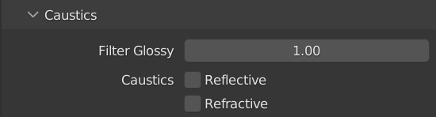

<style>
img{ padding: 10px 10px 10px 10px; border-radius: 10px; box-shadow: rgba(0, 0, 0, 0.24) 0px 3px 8px; }
body{ background-color: #1F1F1F;
    color: white
    }
a{
   color: cyan;
}
.hljs {
	background-color: #333333;
   color: #FFFFFF;
	
}
</style>

[<button > RETOUR AU MENU PRINCIPAL </button>](Index.md)

# Rendu
## Pratique


1. [Caméra](#Caméra)
2. [Réglages de rendu](#Reglages)
3. [Exportation](#Export)

___
___

### Pour commencer, si vous n'avez pas suivi le cours sur la pratique de la [Mise en Lumière](Mise%20en%20Lumi%C3%A8re%20-%20Pratique.md) il faut télécharger le  **[Fichier Blender](Sources/Fichiers%20Blender/Mise%20en%20Lumi%C3%A8re%20-%20Pratique%20FIN.blend)** et l'ouvrir.

<br>

<center>

# Caméra <p id="Caméra"></p> 

</center>

```
Si la caméra n'existe pas, en ajouter une.

```
*S'il n'y a pas de caméra, il faut en ajouter une **Add>Camera***


```
Verrouiller la caméra à la vue et choisir son angle de vue pour le rendu.
```
*Pour déplacer la caméra, il faut déjà entrer dedans. Pour ça, il faut cliquer sur l'icone de caméra sur la droite de l'écran.*


> Raccourci en vue 3D: 0 sur le pavé numérique
> 
<center>

- [x] ASTUCE: Si vous vous perdez dans votre scène, vous pouvez recenter sur la scène en appuyant sur A puis en allant dans View>Frame Selected.
   >Raccourci en vue 3D: "." sur le pavé numérique

</center>

*Pour que la caméra suive les mouvements de l'utilisateur, il faut la verouiller en allant dans le "**menu N**" (Touche **N** du clavier), dans la catégorie **View** et cocher **Camera to View**.*


```
Selectionner la Caméra et ajouter du DOF
```
Après avoir cliquer sur la **caméra**, un menu apparait en bas à droit de l'écran avec un **icone de caméra**. En l'ouvrant, on a affaire à plusieurs réglages.


*On s'intéresse ici à la catégorie **Depth of Field** qu'il faut activer.
En l'ouvrant, on a accès à la **distance de focus**, et à l'**Aperture**.*

*En ouvrant l'Aperture, on a accès aux memes réglages que sur un appareil photo. Pour augmenter le flou on baisse le **F-Stop** à **0.2**.*
Il ne reste plus qu'à **jouer avec la distance de focus** pour que le modèle ne soit pas flou.


<center>

# Réglages de rendu <p id="Reglages"></p> 
#### Cette partie fait écho au cours sur le [Rendu sur Cycles]().

</center>


```
Moteur de Rendu: Cycles
```
Pour ce projet, on choisira le moteur de rendu **Cycles** qu'on active dans l'onglet de réglage de rendu dans l'onglet inférieur droit: il a un icone d'appareil photo.


```
 Réglages de rendu:
   Noise Threshold: 0.01
   Denoise: OID - Albedo/Normal
   Max Samples: 1024
   Light Path Bouces: Total 3
   Caustics: OFF
   Simplify textures: 2048px

Le reste n'a pas à etre modifié.

```
*Dans **Sampling>Render** le **Noise Threshold**  doit etre activé et mis à **0.01**. Il faut aussi **cocher la case** de **Denoise** si ça n'est pas déjà pré-coché. Enfin, **Max Samples** doit etre descendu à **1024**.*


*Dans **Light Paths>Max Bounces** en **Total**, il faut mettre **3**; ça permet à chaque particule de lumière de ne faire que 3 rebonds avant de disparaitre.*


*Dans **Caustics**, il faut tout **décocher**: **Reflective** et **Refractive**.*



*Il faut **activer** l'onglet **Simplify** et dans **Render>Texture Limit** mettre 2048: on limite la taille des textures.*


<center>

- [x] ASTUCE: Dans **Edit>Préferences>System**, suivant la configuration de l'ordinateur, il est possible d'accélérer les rendus sur Cycles. Dans mon cas: Optix affiche mes composants donc je les coche pour obtenir ce petit boost de puissance.
   


</center>

<center>

# Exportation <p id="Export"></p> 

</center>

```
Réglages d'exportation:
   Résolution: 1440 x 1920
   Output: PNG - RGB - 16
```
*Dans les réglages d'exportation sous les réglages de rendu, il suffit de copier les réglages qui sont sur cette image:*


```
Lors d'un rendu d'animation: Attention, à bien choisir le chemin de sortie pour ne pas avoir de mauvaise surprise!
```

```
Il ne reste plus qu'à lancer le rendu.
```
*Pour lancer le rendu il faut aller dans **Render>Render Image** en haut de l'écran.
*


```
Enregistrer l'image
```
*Pour enregistrer l'image, il faut aller dans **Image>Save As...**. Chose qui se fait automatiquement en animation.*


